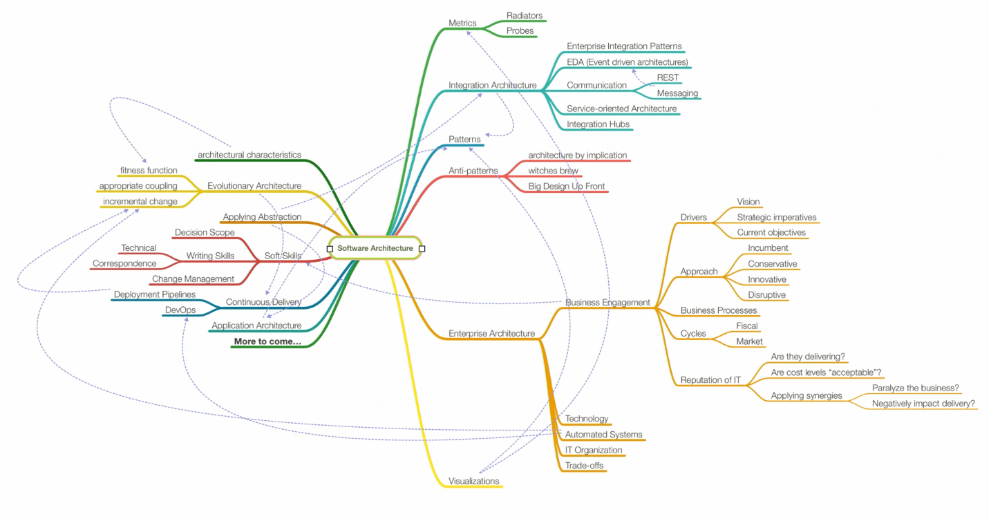

#What is software architecture?

##What do we mean when we talk about software architecture? 
* Surprisingly hard thing to pin down. 
* Is there a succinct, concise definition of software architecture?
* This a mind map that starts touching on all the aspects of software architecture. 

* The architect role keeps expanding, 
* Over the last 5 or 10 years, the role of software architect has actually expanded beyond what it traditionally was a few decades ago. 

##Role of a Software Architect
* Soft skills 
* Thinking beyond rerquirements 
* Considering the business context of the project And these are going to be different on a project-by-project basis. 
  * Taking into account all of the things I know about the solution and a lot of the things that I know about the organization 
* The business drivers are all these architectural concerns that architects must take into account. 

##Business drivers / Architectural characteristics / ilities
* One of the trickiest things about the skill of architecture, is learning how to trade off between these various ilities. 
* Some of these are counter to one another (performance vs scalability / security vs usability)
* Part of the role of architect is to analyze all of these various factors and actually coming up with a design and a plan of attack of how you can implement this piece of software. 

##IEEE (RUP) definition of software architecture
* "the highest level concept of the system in its environment.

##Ralph Johnson definition of software architecture
* "Architecture is the highest level concept of the expert developers of a piece of software."
* This definition adds that architecture is also software architecture is a shared understanding between the people who built the system.
* You can't just take the structure of a software architecture system completely in isolation without understanding the motivations for why they chose a particular approach

##Martin Fowler definition of software architecture
* "Architecture is about the important stuff. Whatever that is."
