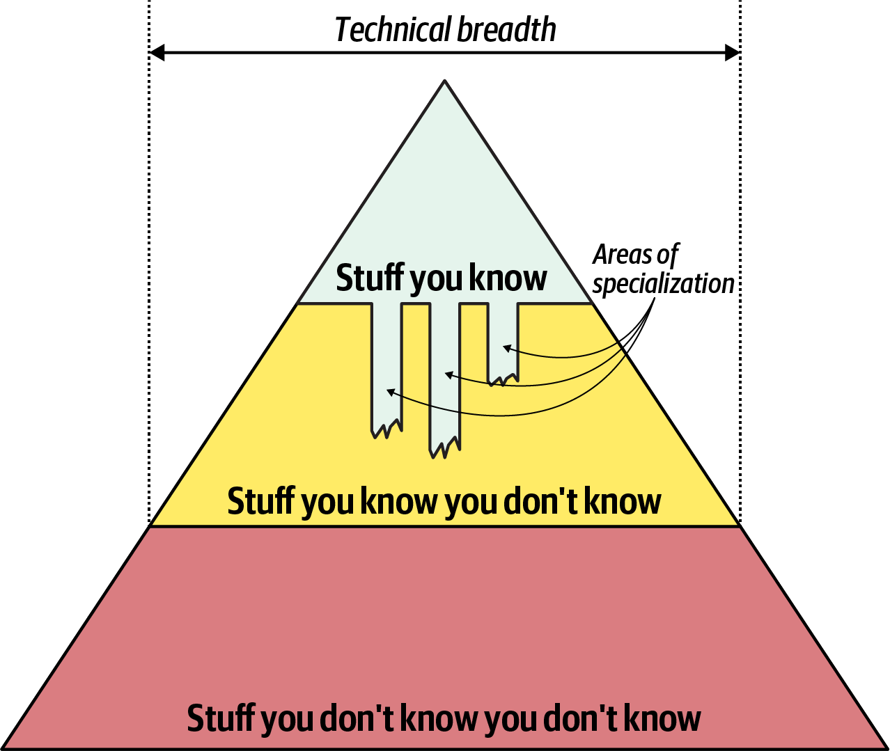

# Thinking Like an Architect

## Technical Depth and Breadth

If you think about all the knowledge in the universe, as far as you know, you can split it into three sections:
1. The stuff that you know
2. The stuff that you know you don't know
3. The stuff that you don't know you don't know.

As you advance as an engineer you make the middle section bigger at the expense of the bottom section, meaning you know that more things exist.

And then, gradually making the top section bigger at the expense of the middle section, because you're learning more things and you're becoming more expert in all those things.

That's how you become an architect. By displaying expertise in a variety of different technical arenas.

However there is something different about software architecture, which may be different from a lot of other fields, is the stuff you know in the software or the technology world is the stuff you have to maintain.

I'm an expert in a technology right now and I don't touch that technology for a year, I'm no longer an expert.

Technical depth, all the things that you are expert in, is probably the thing that's most valued as you're ascending through role of developer to become an architect.

However, after you become an architect, breadth then becomes the more important thing. Because knowing that more things exist is more valuable as an architect than knowing exactly how to implement something in a particular technology.

The way that you became an architect is by exhibiting expertise, and you're going to have to start giving some of that up. And everybody hates giving up expertise, but this is necessary.

Even tho you do want to focus on your breadth more than your depth, there can still still be a few area of passion where you can maintain a level of expertise.

## Architecture and Design

Architects should not be separated from the engineers developing with their design.

Architects should be embedded in the team, leading and receiving feedback about the architecture.

## Stay active in the codebase
* PoCs
* Pair programming
* Code reviews
* Stay out of the critical path

